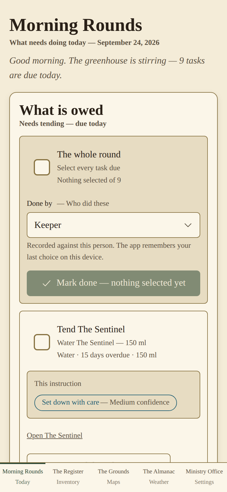
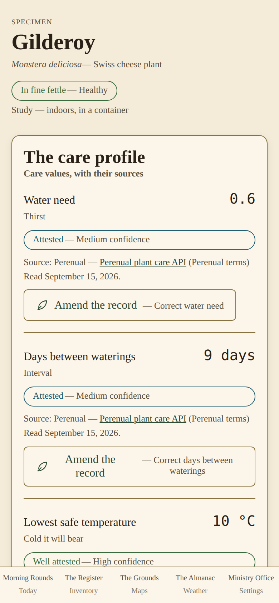
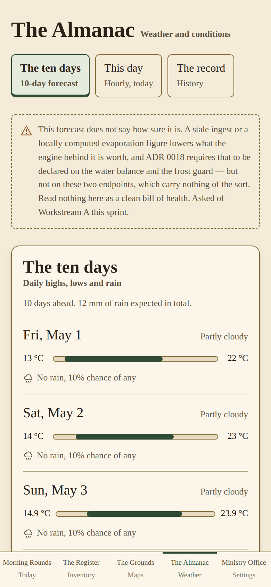
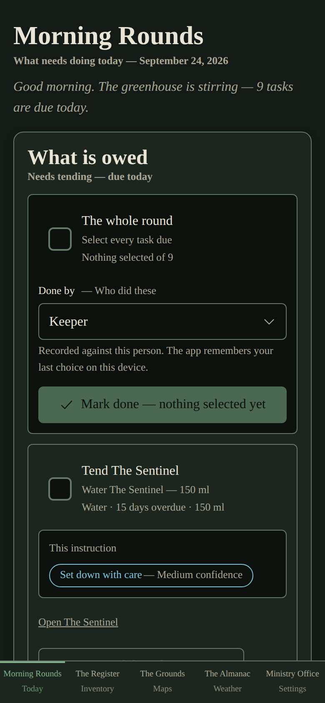
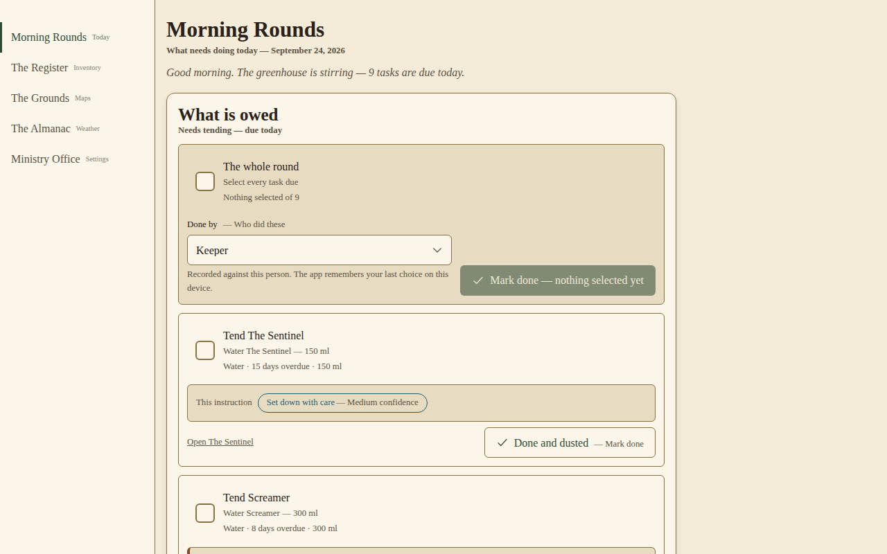
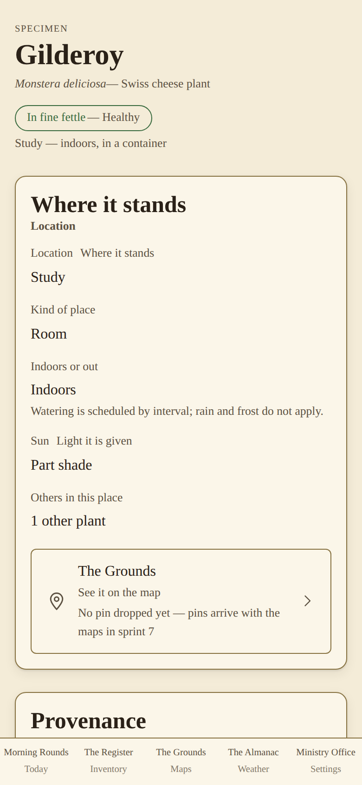
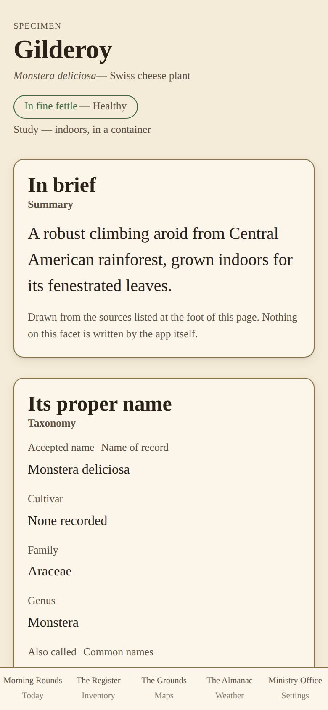
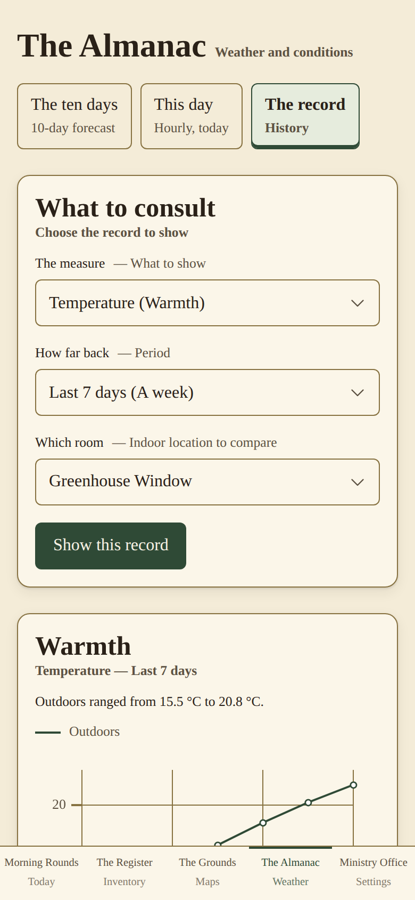

# The Ministry of Herbology

A self-hosted, mobile-first web app for keeping an inventory of your indoor and
outdoor plants and actually tending them — with weather-aware watering, frost
alerts, sensor integration and a wizarding-botany theme.

> **Status: Alpha — Sprint 4 (MVP) complete, 24 September 2026.**
> Contract 1.3.0. Five of eleven sprints are done. The daily care loop works:
> care rules become tasks, tasks show up in **Morning Rounds** and in your
> calendar, and you tick them off. Most other screens are still to come. This
> README is written for the first group of invited alpha testers — please read
> [Before you start](#before-you-start-alpha-testers) first.

<p align="center">
  
  
  
</p>

## Contents

- [Screenshots](#screenshots)
- [Before you start (alpha testers)](#before-you-start-alpha-testers)
- [What works today](#what-works-today)
- [In development, and when to expect it](#in-development-and-when-to-expect-it)
- [Getting started](#getting-started)
  - [1. Try the demo](#1-try-the-demo-about-10-minutes)
  - [2. Install it for your own garden](#2-install-it-for-your-own-garden)
  - [3. Set up your household](#3-set-up-your-household)
  - [4. Add your plants and their care](#4-add-your-plants-and-their-care)
  - [5. Subscribe your calendar](#5-subscribe-your-calendar)
  - [6. Optional: Home Assistant and notifications](#6-optional-home-assistant-and-phone-notifications)
  - [7. Updates and backups](#7-updates-and-backups)
- [Reporting problems](#reporting-problems)
- [Principles](#principles)
- [Stack](#stack)
- [Documentation](#documentation)

## Screenshots

Taken from the running app in demo mode, so the household, its plants and the
weather are the built-in sample data rather than a real garden.

| Morning Rounds (dark) | Morning Rounds (desktop) |
| :---: | :---: |
|  |  |

| Specimen: Register Entry | Specimen: Compendium | Almanac: history |
| :---: | :---: | :---: |
|  |  |  |

One more is in the folder: [the Almanac's hourly view for today](docs/screenshots/almanac-today.png).

## Before you start (alpha testers)

This is an early build, shared with a small group on purpose. Four things to
know before you install it:

1. **There is no login.** Anyone who can reach the address can see and change
   everything. Keep it on your home network, or behind a VPN such as WireGuard
   or Tailscale. **Do not expose it to the internet.** One shared login with a
   member picker is planned (ADR 0008) but is not built yet.
2. **Setup is partly done outside the app.** The screens for adding a plant,
   running your household and managing calendar feeds don't exist yet. For
   now you do those steps through the API's built-in page at
   `/api/v1/docs`, plus one short database command. The steps are
   [below](#getting-started), and each one has been tried against a real
   database.
3. **Only tell the app what you know.** The app never makes up plant facts.
   Online enrichment doesn't save its results to your database yet, so a new
   plant starts with no care values. You give it a watering interval yourself
   (a *care rule*). Until you do, it sits under "Nothing is scheduled for
   these" in Morning Rounds, and it isn't forgotten.
4. **Your data is yours to keep.** There is no hosted service. Everything
   lives in the database on your machine, and `make backup` makes a copy
   ([§7](#7-updates-and-backups)).

### Known issues in this build

These are the ones we already know about, so there's no need to report them
again:

| Issue | What you will see | Plan |
| --- | --- | --- |
| Morning Rounds and the calendar feed fail in a real installation. The scheduler reads a database column it never declared. | Morning Rounds shows an error, and the calendar feed doesn't load. Demo mode is not affected. | A one-line fix to Workstream G's table definition. It must land **before invitations go out**. |
| The weather and frost panels still show sample data in a real installation. | Frost warnings for plants that aren't yours (such as "Sour Bertram"), and a May forecast. | The ingest workers have not been connected to the database yet. Until they are, ignore the frost panel. It is the top item for S5 and S6. |
| The Register, The Grounds and Ministry Office links in the navigation go nowhere. | "That page is not here". | See [In development](#in-development-and-when-to-expect-it). |
| Plants added without a date acquired count their watering cycle from a fixed date in the past. | A new plant shows as hundreds of days overdue. | Always set `acquired_on` when you add a plant ([§4](#4-add-your-plants-and-their-care)). Tick the task once and the cycle restarts from that day. |
| Sprint 4 left a few requests open with the architect: the plain half of a button label is too faint on filled buttons, and ticking a task to select it also strikes it through. | Cosmetic. | Tracked in `docs/sprints/S4-workstream-j.md`. |

## What works today

| Area | Works now | Notes |
| --- | --- | --- |
| **Morning Rounds** (home) | Today's tasks, overdue first. Tick several and mark them done at once, or finish one with a single tap. Each completion records who did it. | Every task shows how sure the app is of it. A guess is shown as a guess. |
| **Care rules → tasks** | Interval rules per plant or per species, with season and dormancy adjustments based on your latitude. | Rules come from cited care values or from you. |
| **Calendar feed** | A private `webcal://` link per household member, with filters. Works in Google Calendar and Apple Calendar. Routine tasks are all-day events. Frost tasks are timed events with a reminder. | Google refreshes subscribed calendars slowly, about every 12 hours or more. |
| **Specimen pages** | Register Entry, Tending and Compendium, linked to each other. | Journal is S8. |
| **Care values** | Every value carries its source, its confidence and an edit button. A value with no citation is marked *unknown*. | Wikipedia, Wikidata and USDA connectors exist. See point 3 above. |
| **The Almanac** | 10-day forecast, hourly for today, and a 1/7/30-day history, indoors and outdoors. | Live data isn't wired up yet. See the known issues. |
| **Home Assistant** | Indoor temperature and humidity from any Home Assistant entity (Nest, HomeKit, Matter and others). Readings are published back over MQTT. Rounds, frost and health notifications go to the HA companion app. | Optional. Written against HA's documentation and not yet run against a real hub. Please tell us how it goes. |
| **Look and feel** | Parchment (light) and night-greenhouse (dark) themes follow your phone's setting. Mobile-first, keyboard-navigable and checked for WCAG AA contrast. | |
| **Deployment** | One Docker swarm stack behind Nginx with TLS. Backup and restore are tested, not just described. | The [deployment guide](docs/deploy/README.md) has been followed end to end on one machine. |

## In development, and when to expect it

The plan has eleven sprints, S0–S10. **S0 to S4 took five days (20–24
September 2026)**, well ahead of the planned one week per sprint. The
"expected" dates below assume the remaining sprints go at roughly that pace
(about one to two days each, after a short stabilisation pass on the known
issues). The "at the latest" dates assume the plan's one week per sprint.
Treat both as estimates, not promises.

| Sprint | Theme | What it adds for you | Expected | At the latest |
| --- | --- | --- | --- | --- |
| — | Stabilise the alpha | The known-issue fixes above: Morning Rounds working in a real installation, and the weather and frost ingest connected to the database | before invites | — |
| **S5** | Smart watering | Outdoor watering driven by a daily soil water balance (rain minus evaporation). A watering the rain covered shows "Sated by the heavens — rain covered it" instead of disappearing. | ~27 Sep | 1 Oct |
| **S6** | Frost guard | Frost warnings per species, 72 hours ahead, including National Weather Service advisories. "Bring indoors" and "return outdoors" tasks, with a prompt for the plant's new spot. 7- and 30-day history charts. | ~30 Sep | 8 Oct |
| **S7** | Maps (The Grounds) | Upload a floor plan or a property survey, calibrate it, draw zones and pin every plant. Tapping a pin opens that plant. | ~2 Oct | 15 Oct |
| **S8** | The Naturalist's Journal | An illustrated botanical plate for each plant from public-domain sources, field notes, a photo growth log and a page-turning book view. | ~5 Oct | 22 Oct |
| **S9** | Whimsy & integrations | Animations (they respect reduced-motion), a full accessibility audit, offline care pages, the Lunette e-ink feed, near-instant Google Calendar and iCloud push, and a screen for managing calendar feeds. | ~8 Oct | 29 Oct |
| **S10** | Hardening → **v1.0** | Performance, the full end-to-end test suite, user documentation and release notes. | ~12 Oct | 5 Nov |

**Needed, but not yet assigned to a sprint:** the Register screen (search and
filter your plants), the "add a plant" screen (name or photo, confirm the
match, drop a pin), the Ministry Office settings screens, the shared login,
and saving enrichment results to the database. The maintainer will slot these
in during the stabilisation pass. Alpha feedback on which ones hurt most will
decide the order.

## Getting started

There are two ways in. **Try the demo** to look around with sample data in
about ten minutes. **Install it for your own garden** when you want to track
your real plants.

### 1. Try the demo (about 10 minutes)

The demo runs entirely on your computer with a built-in fictional household:
twelve plants, seven locations and thirty days of recorded weather. It needs
no accounts, no keys and no internet after the first download. Anything you
change is kept in memory and lost when you stop it.

**You need:** `git`, `make`, and Docker with Compose v2 (Docker Desktop on Mac
or Windows, or Docker Engine 24+ on Linux).

```sh
git clone https://github.com/mtaylor45/ministry-of-herbology.git
cd ministry-of-herbology
make dev
```

The first run downloads and builds the images. When it finishes:

- **The app:** <http://localhost:5173>. On your phone, use your computer's
  LAN address instead of `localhost`.
- **The API and its interactive docs:** <http://localhost:8000/api/v1/docs>

Things to try: tick two tasks in Morning Rounds and press *Mark done*. Open a
plant and compare its Tending and Compendium facets. Switch your phone or
computer to dark mode.

`make down` stops everything.

<details>
<summary><strong>Without Docker</strong> (Python 3.11 and Node 22)</summary>

```sh
git clone https://github.com/mtaylor45/ministry-of-herbology.git
cd ministry-of-herbology
python3.11 -m venv .venv
.venv/bin/pip install -e 'api[dev]'

# Terminal 1 — the API, serving the sample household
cd api
MOH_MOCK_MODE=true PYTHONPATH="$PWD:$PWD/.." ../.venv/bin/uvicorn app.main:app --port 8000

# Terminal 2 — the web app
cd web
npm ci
npm run dev
```

Then open <http://localhost:5173>. The screenshots above were taken this way.

</details>

### 2. Install it for your own garden

A real installation runs as a Docker swarm stack: the database, the API, the
web app, four background workers, an MQTT broker and Nginx for HTTPS. **One
Linux machine is enough.** A small home server or NAS that can run Docker
works well. The full walkthrough, with a troubleshooting section, is the
**[deployment guide](docs/deploy/README.md)**. Here is the short version.

**You need:**

- a Linux machine with Docker Engine 24 or newer, and `git`, `make` and `openssl`;
- a hostname for it on your network (e.g. `herbology.home.arpa`) and a TLS
  certificate for that name. A self-signed one is fine on a home network
  ([guide §5](docs/deploy/README.md#5-certificates));
- an email address for the US National Weather Service's contact requirement.

**Steps**, on that machine:

```sh
# 1. Get the code. Keep this folder: upgrades and backups run from it.
git clone https://github.com/mtaylor45/ministry-of-herbology.git
cd ministry-of-herbology

# 2. Build the three images. On a single machine no registry is needed.
#    Guide §3 has the one-line Makefile edit this needs: remove
#    --resolve-image=always from the stack-deploy target.
make images MOH_REGISTRY=local/moh        # prints the tag it built

# 3. Turn on swarm mode.
docker swarm init

# 4. Create the six secrets: database password, the two MQTT passwords,
#    Home Assistant token (may be blank), TLS certificate and key.
#    Every command is in guide §6. You generate each value yourself.

# 5. Write .env.deploy with your four required values.
cat > .env.deploy <<'EOF'
MOH_REGISTRY=local/moh
MOH_IMAGE_TAG=<the tag step 2 printed>
MOH_PUBLIC_BASE_URL=https://herbology.home.arpa
MOH_NWS_USER_AGENT=ministry-of-herbology (you@example.net)
EOF

# 6. Deploy, and wait until every service reads Running.
make stack-deploy
make stack-ps

# 7. Create the database tables (safe to run again).
make migrate
```

Check it's up. `-k` accepts a self-signed certificate:

```sh
curl -sk https://localhost/api/v1/healthz
# {"status":"ok","contract_version":"1.3.0","mode":"live"}
```

`"mode":"live"` means you're on your own database. **Don't load the sample
data (`make fixtures`) into an installation you plan to keep.** Separating the
fictional household from your own plants later is painful
([guide §10](docs/deploy/README.md#10-fixtures-and-why-you-probably-do-not-want-them)).

Then open `https://<your hostname>` on your phone and use *Add to Home Screen*
to install it as an app.

### 3. Set up your household

There's no settings screen yet, so your site and the people in your household
go in with one database command. Run it on the machine hosting the database:

```sh
docker exec -it $(docker ps -qf label=com.docker.swarm.service.name=moh_db) \
  psql -U herbology -d herbology
```

Then paste, with your own values:

```sql
-- Your garden. The weather comes from these coordinates. The timezone decides
-- when "today" starts. nws_zone is for US frost advisories only; leave it NULL
-- elsewhere, or look yours up at https://alerts.weather.gov.
INSERT INTO site (id, name, latitude, longitude, timezone, nws_zone)
VALUES (gen_random_uuid(), 'Home', 39.7684, -86.1581,
        'America/Indiana/Indianapolis', 'INZ047');

-- Everyone who tends the plants. Role: keeper, tender or observer.
INSERT INTO member (id, name, role) VALUES
  (gen_random_uuid(), 'Alex', 'keeper'),
  (gen_random_uuid(), 'Sam',  'tender');

-- Note the ids. You'll need them in the next steps.
SELECT id, name FROM site;
SELECT id, name FROM member;
```

`\q` quits.

### 4. Add your plants and their care

Until the add-a-plant screen lands, open **`https://<your hostname>/api/v1/docs`**.
Every call below can be made from that page: open the endpoint, choose *Try it
out*, paste the body and press *Execute*. The `curl` equivalents are shown
here too. Put your hostname in `$MOH` first:

```sh
MOH=https://herbology.home.arpa/api/v1     # add -k to curl for a self-signed cert
```

**a. A place for it to live.** `kind` is one of `area`, `zone`, `bed`,
`room` or `shelf`. Outdoor spots can also set `is_covered` (rain doesn't
reach) and `sun_exposure` (`full_sun`, `part_sun`, `part_shade`,
`full_shade`).

```sh
curl -s -X POST "$MOH/locations" -H 'content-type: application/json' -d '{
  "site_id": "<site id>", "name": "Kitchen windowsill",
  "kind": "shelf", "is_outdoor": false }'
```

**b. The plant.** Always set `acquired_on`, because the watering cycle counts
from that date.

```sh
curl -s -X POST "$MOH/specimens" -H 'content-type: application/json' -d '{
  "name": "Peace lily", "location_id": "<location id>",
  "in_container": true, "acquired_on": "2026-09-22" }'
```

**c. Its care.** Set how often it needs watering, and how much. You can also
use `fertilize`, `repot` and other task types. The API docs page lists them
under `TaskType`.

```sh
curl -s -X POST "$MOH/tending/care-rules" -H 'content-type: application/json' -d '{
  "specimen_id": "<specimen id>", "task_type": "water",
  "strategy": "interval", "base_interval_days": 7, "amount_ml": 250 }'
```

Open the app and the plant's first watering is in Morning Rounds. Tick it off
when it's done, and the next one is scheduled from that day.

### 5. Subscribe your calendar

Each household member can have one or more private feeds. Create one:

```sh
curl -s -X POST "$MOH/tending/feeds" -H 'content-type: application/json' -d '{
  "member_id": "<member id>", "name": "All my plants" }'
```

The response has a `webcal_url`.

- **Apple Calendar** (iPhone or Mac): open the `webcal://` link, or go to
  *Settings → Calendar → Accounts → Add Subscribed Calendar*.
- **Google Calendar** (on the web): *Other calendars → + → From URL*, and
  paste the `https_url` version.

**Treat the link like a password.** Anyone with it can read your plant
schedule. If one leaks, revoke it with `POST /tending/feeds/{feed_id}/revoke`
and make a new one. To split feeds, add `"filters"`, e.g.
`{"outdoor": true, "task_types": ["water"], "location_ids": ["<location id>"]}`.

### 6. Optional: Home Assistant and phone notifications

Home Assistant is the only route for indoor sensor readings (ADR 0009).
Without it the app still works on the weather and your own records.

1. **Connect it:** create a long-lived access token in Home Assistant, store
   it as the `moh_ha_token` secret, set `MOH_HA_BASE_URL` in `.env.deploy`,
   and point Home Assistant's MQTT integration at this machine on port 1883.
   The step-by-step is in
   [guide §11](docs/deploy/README.md#11-connecting-home-assistant). **Keep
   port 1883 on your LAN.**
2. **Notifications** go to the Home Assistant companion app on your phone.
   Give each member their notify service, and optionally the hour their
   morning rounds should arrive and their quiet hours:

   ```sql
   UPDATE member SET notify_prefs = '{
     "home_assistant": {
       "service": "mobile_app_alexs_iphone",
       "rounds_hour": 7,
       "quiet_hours": [22, 7],
       "frost": true
     }
   }' WHERE name = 'Alex';
   ```

   Frost alerts are the only ones that break through quiet hours. Set
   `"frost": false` if you'd rather they didn't. You can turn off `"rounds"`
   and `"health"` the same way.

### 7. Updates and backups

When a new build is announced, from your `ministry-of-herbology` folder:

```sh
git pull
make images MOH_REGISTRY=local/moh     # note the new tag
# update MOH_IMAGE_TAG in .env.deploy, then:
make stack-deploy
make migrate
```

Rolling back and rotating secrets are covered in
[guide §12](docs/deploy/README.md#12-upgrading).

**Back up before every update:**

```sh
make backup          # writes a dump into ./backups/
make restore-check   # proves the newest one restores, in a scratch database
```

Copy `./backups/` somewhere off the machine. Restoring for real is in
[guide §13](docs/deploy/README.md#13-backup-and-restore).

## Reporting problems

Please do! What helps most:

- **What you did, what you expected, and what you saw.** A phone screenshot is
  perfect.
- **Your version**, from `curl -sk https://localhost/api/v1/healthz` and
  `git describe --tags --always`.
- For install problems, `make stack-ps` and `docker service logs moh_api`
  (or whichever service is unhappy).

Open an issue on this repository, or send it to the maintainer directly.
**Leave out tokens, passwords and calendar links.** The app is built never to
print them, and your report shouldn't either.

It's especially useful to hear when the app **was wrong about a plant**, when
it **sounded surer than it should have**, and which missing screen you missed
most.

## Principles

Care values are never invented. Each one carries a source citation and a
confidence level, and you can edit any of them. Every themed status is paired
with a plain one ("Parched — water today"). When the app can't work something
out, it tells you, rather than staying silent. The theme is original
wizarding-botany, with no franchise assets.

## Stack

SvelteKit PWA · FastAPI (Python 3.11) · Postgres 16 + TimescaleDB · Redis +
Arq · Leaflet · uPlot, deployed as a Docker stack behind Nginx. See
[ADR 0002](docs/adr/0002-stack.md).

Contributors: `make test` runs the suites, and `CLAUDE.md` is the working
agreement.

## Documentation

- [Deployment guide](docs/deploy/README.md) — install, upgrade, back up, troubleshoot
- [Development plan](docs/plan/development-plan.md) — scope, architecture, sprints
- [Sprint notes](docs/sprints/) — what each sprint shipped, and what it left open
- [Workstreams](docs/agents/README.md) — who owns what
- [Architecture decisions](docs/adr/) — ADRs
- [Contracts](contracts/README.md) — schema, OpenAPI, events
- [Style guide](docs/design/style-guide.md) — the visual reference
