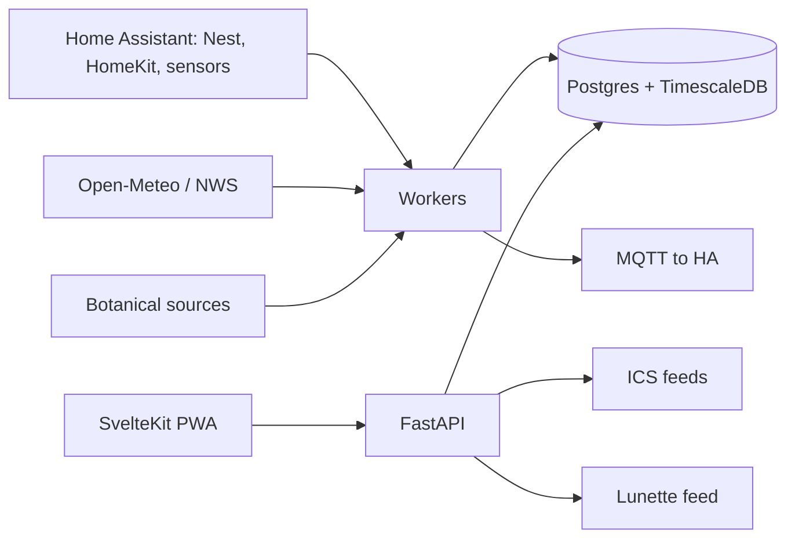

# The Ministry of Herbology — Development Plan

> Source of truth for scope, architecture and sprints. Mirrors the project plan
> document. Changes to this file go through Workstream A.

## Overview & agent operating rules

The Ministry of Herbology is a self-hosted, mobile-first web app for inventorying
indoor and outdoor plants and tending them, with weather- and sensor-aware care
scheduling and a wizarding-botany theme. The build runs as 11 one-week sprints
(S0–S10) across 12 AI agent workstreams, with a daily-usable MVP at the end of S4.

### Rules every agent follows

1. **Contract-first.** The DB schema, OpenAPI spec and fixture data are frozen in
   S0. Only Workstream A (Architect) may change them, via an ADR.
2. **Own your directory.** Each workstream writes only inside its owned paths.
   Cross-cutting changes go through A.
3. **Build against mocks.** Every service ships a mock matching the contract, so
   no agent waits on another.
4. **One task, one PR.** Each PR carries tests, a short description, and a link to
   its sprint task. A reviews and merges.
5. **Definition of done:** tests pass in CI, the change deploys to staging, the UI
   meets WCAG AA, and docs are updated.
6. **No invented plant facts.** Every care value carries a source citation and a
   confidence level, and the user can edit it.
7. **Theme without franchise assets.** Wizarding-botany aesthetic only: no crests,
   house names, film typefaces or character names.
8. **Weekly integration demo** at the end of each sprint, with exit criteria
   checked by the maintainer.

## Scope

v1.0 covers the original requirements, all accepted review additions, and calendar
subscription.

### Core (original)

- Web interface; inventory of indoor and outdoor plants.
- Maps: outdoor plants on a property survey, indoor plants on floor plans.
- Auto-enrichment from Wikipedia and other sources when a plant is added.
- Per-plant care: light, water, fertilizer, soil chemistry, and other relevant needs.
- Linked detail views: Register (inventory), Tending (care), Compendium
  (education), Naturalist's Journal (illustrated plates).
- Maintenance scheduling, including per-plant watering.
- Live weather for outdoor plants (rain, sun, temperature).
- Watering marked as satisfied when rainfall covers the need.
- Frost alerts telling you to move outdoor potted plants indoors.
- Indoor temperature and humidity from Home Assistant, Google Home (Nest 4th gen
  Learning Thermostat) and Apple HomeKit.
- Weather: 1-day and 10-day forecast. Conditions history: 1-, 7- and 30-day,
  indoor and outdoor.
- Whimsical wizarding-herbology theme throughout.

### Accepted additions

- Taxonomy resolution at intake (accepted scientific name + cultivar); optional
  photo ID via Pl@ntNet.
- Layered botanical sources with citations and confidence; user-editable care values.
- Toxicity flags for children and pets.
- Per-plant soil water balance (rain minus ET₀) instead of fixed rain thresholds.
- Per-species frost thresholds, 72h lookahead, NWS frost/freeze advisories.
- Home Assistant as the integration hub; publish sensors and alerts back to HA.
- Self-collected time-series history from day one.
- Microclimate zones with sun exposure; indoor/outdoor and covered flags.
- Plant groups and beds; photo growth log; pest/disease and repotting logs.
- Household members with task completion attribution; notifications.
- Seasonal and dormancy adjustments to care.
- Soil moisture sensors (Ecowitt, MiFlora via HA) as watering overrides — supported,
  but no such hardware exists yet (ADR 0010).
- Journal plates from public-domain sources first, AI-generated fallback in one
  consistent style.
- Mobile-first installable PWA with offline care instructions.
- Backup, restore and data export.
- Feed for the Lunette e-ink display.

### Calendar subscription

- Private, tokenized ICS (`webcal://`) feed per household member, subscribable in
  Google and Apple Calendar.
- Filters by indoor/outdoor, task type and location; each filter set is its own feed.
- Optional direct push via Google Calendar API or CalDAV (iCloud) for
  near-real-time updates.

### Out of scope for v1.0

- Irrigation hardware control (pending decision).
- Public or multi-household hosting.

## UX & information architecture

The app is plant-centric. There are five global sections, and every plant has one
Specimen page with four linked facets.

### Global navigation (bottom bar on mobile, sidebar on desktop)

| Section | Plain meaning | Contents |
| --- | --- | --- |
| Morning Rounds | Today (home) | Tasks due, rain-satisfied waterings, frost warnings, one-tap and batch completion |
| The Register | Inventory | Search, filter by location, zone, status and toxicity; groups and beds |
| The Grounds | Maps | Indoor floor plans and outdoor survey as layers; zones and pins |
| The Almanac | Weather & conditions | 1-day and 10-day forecast; 1/7/30-day indoor and outdoor history |
| Ministry Office | Settings | Integrations, locations, household, calendar feeds, backups |

### Specimen page facets — `/specimen/:id/<facet>`

| Facet | Route | Contents |
| --- | --- | --- |
| Register Entry | `register` | Location, mini-map, provenance, container and soil, photos, growth log |
| Tending | `tending` | Care profile with sources, schedule, task history, water balance, frost status |
| Compendium | `compendium` | Summary, taxonomy, native range, toxicity, lore and uses |
| Naturalist's Journal | `journal` | Illustrated plate, field notes; also browsable as a global page-turning book |

Every facet shows "see also" links to the other three. Map pins open the Specimen
page; the Specimen page shows its pin.

### UX principles

- Pair each themed status with a plain one: "Parched — water today", "Sated by the
  heavens — rain covered it".
- Display fonts (IM Fell / Cinzel style) for headings only; a readable serif for
  body text; WCAG AA contrast.
- Light parchment mode and a dark "night greenhouse" mode.
- Adding a plant takes three steps: name or photo, confirm the match, drop a pin.
  Enrichment runs in the background ("An owl has been dispatched…").
- Whimsy at moments only: quill checkmark on completion, raindrops on
  rain-satisfied tasks, frost creeping over alert cards. Honor reduced-motion.
- Installable PWA; care instructions available offline.

## Architecture, stack & data model

The stack is SvelteKit PWA + FastAPI + Postgres/TimescaleDB, deployed as a Docker
stack on the 3-node compute swarm with images in Harbor, behind Nginx.

| Layer | Choice | Notes |
| --- | --- | --- |
| Frontend | SvelteKit PWA | Mobile-first; offline cache for care pages |
| Maps | Leaflet | `CRS.Simple` for floor plans; georeferenced overlay for the survey |
| Charts | uPlot | 1/7/30-day history; forecast strips |
| API | FastAPI (Python) | OpenAPI contract is the source of truth |
| Database | Postgres + TimescaleDB | Hypertables for sensor and weather readings; continuous aggregates for rollups |
| Jobs | Redis + Arq workers | Polling, enrichment, rule evaluation, feed rendering |
| Images | NAS share or MinIO | Plates, photos, uploaded plans |
| Hub integration | Home Assistant REST + WebSocket | Covers Nest, HomeKit, Matter, soil sensors |
| Publish-back | MQTT discovery | Plant alerts and task counts as HA entities |
| Weather | Open-Meteo + NWS API | Forecast, history, ET₀; frost/freeze advisories |
| Deploy | Docker stack, Harbor, Nginx | Staging and prod stacks on the compute swarm |



Workers ingest from outside sources into the database; the API serves the PWA,
calendar feeds and Lunette.

### Core entities

| Entity | Key fields |
| --- | --- |
| Species | Accepted name, family, common names, care profile, toxicity, min temp, sources, confidence |
| Specimen | Species, cultivar, nickname, is_group, count, location, container, soil, acquired date, status |
| Location | Site → area → zone; indoor/outdoor; covered; sun exposure; map layer + coordinates |
| MapLayer | Type (floor plan or survey), image, calibration points, scale |
| SensorSource | Adapter type, entity ids, location |
| Reading | Time, source, metric, value (hypertable) |
| WeatherObs / Forecast | Time, precip, temp, ET₀, sun, wind (hypertable) |
| CareRule | Specimen or species, task type, base interval, modifiers (season, weather) |
| Task / TaskEvent | Due, type, status, satisfied_by, completed_by, notes |
| CalendarFeed | Member, token, filters |
| Plate | Specimen or species, image, source, license, style |
| Photo / LogEntry | Specimen, time, image or text, kind (growth, pest, repot) |
| Member | Name, role, notification prefs |

## Key engines

Three engines carry the app's intelligence. Each must pass fixture scenarios
(drought, storm, frost) before its sprint closes.

### Water balance (outdoor)

Each outdoor specimen keeps a daily soil water deficit. Watering is due when the
deficit crosses the plant's threshold.

```
D(t) = clamp( D(t-1) + K_c · ET₀(t) − f_cover · P(t) − I(t),  0,  D_max )
```

Where `D` is the deficit (mm), `K_c` the plant water-need coefficient from the care
profile, `ET₀` from Open-Meteo, `P` the rainfall, `f_cover` 0 for covered spots and
1 for open ones, and `I` any manual watering logged.

- Container plants use a smaller capacity and reach their threshold faster than
  in-ground plants.
- When rain drops the deficit below threshold, the due task shows "satisfied by
  rain" instead of disappearing.
- A soil moisture sensor reading, when present, overrides the model.
- Indoor plants use interval rules adjusted by season and indoor humidity.

### Frost guard

- Alert when the forecast low within 72h falls below the species minimum + 3 °F
  margin, or an NWS frost/freeze advisory covers the site.
- Applies to specimens that are outdoor and in containers; in-ground tender plants
  get "cover or protect" tasks instead.
- Creates a "bring indoors" task, due by sunset before the cold night. Completing
  it prompts for the new indoor location.
- A matching "return outdoors" suggestion appears after 3 consecutive forecast
  nights above threshold.

### Calendar feed

- One ICS feed per member and filter set, at a private tokenized URL that can be
  revoked.
- Events use stable UIDs per task, so reschedules and rain cancellations update or
  remove in place.
- Titles are themed with plain meaning ("Tend the Monstera — water 500 ml"), with
  care notes and a deep link to the Tending facet.
- Frost tasks are timed events with a reminder; routine tasks are all-day events.
- Google refreshes subscribed feeds slowly (12h+). Optional push via Google
  Calendar API or CalDAV covers members who need faster updates.
- Completion happens in the app; the event link opens one-tap completion.

## Workstreams

Twelve agents, each owning one directory in the monorepo. A is the only agent that
edits `contracts/`.

| ID | Workstream | Owns | Responsibilities |
| --- | --- | --- | --- |
| A | Architect / Integrator | `contracts/`, `docs/adr/` | Schema, OpenAPI, ADRs, reviews and merges all PRs, sprint demos |
| B | Platform & DevOps | `infra/`, `.github/` | Monorepo, CI, images to Harbor, swarm stacks, secrets, backups, monitoring |
| C | Inventory & Core API | `api/inventory/` | Specimens, locations, zones, groups, photos, logs, search, members |
| D | Botanical Knowledge | `workers/botany/` | Taxon resolution, source connectors, cited care synthesis, toxicity, caching |
| E | Weather & Environment | `workers/weather/`, `api/almanac/` | Open-Meteo and NWS ingest, water balance, frost engine, rollups |
| F | Home & IoT | `workers/hub/` | HA adapter (Nest, HomeKit, Matter), soil sensors, MQTT publish-back, calendar push adapters |
| G | Scheduling & Rules | `api/tending/` | Care rules, recurrences, weather/season modifiers, notifications, ICS feeds |
| H | Spatial & Maps | `api/grounds/`, `web/src/lib/map/` | Plan and survey upload, calibration, zones, pins, map component |
| I | Design System | `web/src/lib/ui/`, `web/src/app-shell/` | Theme tokens, typography, components, PWA shell, nav, accessibility |
| J | Feature UI | `web/src/routes/` | Morning Rounds, Register, Specimen facets, Almanac, Ministry Office |
| K | Naturalist's Journal | `workers/plates/`, `web/src/routes/journal/` | Public-domain plate sourcing, AI fallback pipeline, style guide, book view |
| L | QA & Docs | `tests/`, `fixtures/`, `docs/user/` | Weather scenario fixtures, e2e suite, contract tests, user docs |

### Handoffs

- **D → G**: care profile fields (`k_c`, intervals, min temp) feed care rules.
- **E → G**: daily deficit and frost flags feed task generation.
- **F → E and G**: indoor readings and soil moisture feed the engines.
- **G → F**: calendar push uses F's Google and CalDAV adapters.
- **I → J, H, K**: all UI uses design-system components only.

## Sprint plan

Eleven one-week sprints. The MVP (daily-usable care schedule) lands at the end of
S4; v1.0 ships at the end of S10.

| Sprint | Theme | Deliverables (workstream) | Exit criteria |
| --- | --- | --- | --- |
| S0 | Charter | ADRs, schema v1, OpenAPI v1 (A); monorepo, CI, dev compose, Harbor push (B); moodboard, tokens, type scale (I); weather and plant fixtures (L) | Every agent runs the full stack locally on mocks |
| S1 | Skeleton | Specimen, location and zone CRUD with exposure fields (C); taxon resolution via POWO/GBIF (D); component library v1, app shell, nav (I); staging stack on swarm (B) | Add a plant by name; it appears in the Register on staging |
| S2 | Enrichment | Wikipedia, Wikidata, USDA, Perenual connectors; cited care synthesis; toxicity (D); Specimen page with Register, Tending, Compendium facets (J) | A new plant auto-fills summary and care with sources in under 60s |
| S3 | Environment | Open-Meteo forecast and history ingest; Timescale rollups (E); HA adapter with Nest readings (F); Almanac 1-day and 10-day views (J) | Indoor and outdoor readings stored every 5–15 min; forecast visible |
| S4 | Scheduling (MVP) | Care rules to tasks, recurrences, completion logging (G); Morning Rounds with batch completion (J); HA notifications (F); ICS feed with filters and deep links (G) | Daily care runs from the app and tasks appear in the calendar |
| S5 | Smart watering | Water-balance engine, "satisfied by rain" state (E, G); soil sensor override kept and proved against fixtures, no hardware (F, ADR 0010); drought and storm scenario tests (L) | Scenario suite passes; rain visibly clears due waterings |
| S6 | Frost guard | Per-species thresholds, 72h lookahead, NWS advisories (E); bring-indoors and return tasks with relocation flow (G, J); frost calendar events and cancellation behavior (G); 7-day and 30-day history charts (J) | Frost scenario raises alert, task, calendar event, and updates location on completion |
| S7 | Maps | Plan and survey upload with calibration, zone drawing, pins (H); map and Specimen cross-links (J) | Every specimen can be pinned; tapping a pin opens its Specimen page |
| S8 | Journal | Public-domain plate sourcing, AI fallback pipeline, style guide (K); journal facet and book view, field notes, photo growth log (K, J) | Each specimen has an approved plate; the book view pages through all |
| S9 | Whimsy & integrations | Animations, dark mode, accessibility audit, offline PWA (I, J); Lunette feed and HA entities (F); optional Google and CalDAV push, feed management UI (F, G) | WCAG AA audit passes; Lunette shows today's rounds; push updates arrive in minutes |
| S10 | Hardening | Backup and restore drill, performance pass (B); full e2e suite (L); user docs (L); release notes (A) | Restore from backup succeeds; e2e green; v1.0 tagged and deployed |

## Open decisions

All five are now answered; ADR 0006 records the trail. Decisions taken since are
ADRs 0011–0016.

- ~~Paid APIs acceptable?~~ **Answered: free sources only** (ADR 0007).
  Perenual and generated plates stay behind disabled feature flags.
- ~~Nest route: HA Nest integration (SDM API) or Matter?~~ **Answered: neither.
  Indoor conditions come from Home Assistant** (ADR 0009).
- ~~Survey format: PDF plat, CAD file, or satellite image only?~~ **Answered:
  raster image plus two-point georeferencing** (ADR 0015).
- ~~Separate logins per household member, or one shared login with a member
  picker?~~ **Answered: shared login with a member picker** (ADR 0008).
- ~~Any irrigation hardware to control?~~ **Answered: none today, and no
  soil-moisture hardware either. Keep the seams for both** (ADR 0010).
